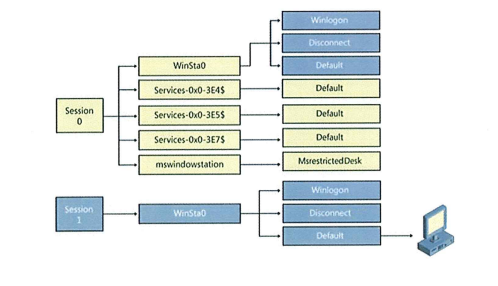

Merged exams from past years
-----------------------------

### Design principles
1. Explain the principle of least privilege. What is the intention of this design principle?
	* **Answer**: The principle of least privilege means that a process runs with as low privileges as possible to complete its task, and only requests higher privileges temporarily when required. This is meant to protect against unwanted or unexpected results, and to prevent attackers from gaining higher privileges if the software is compromised. If the application can run with low privileges, there is no reason for it to run with high privileges as it could compromise the system in case it's exploited.
2. Explain the principle of complete mediation. What is the intention of this design principle and what do you need to be aware of when implementing access checks?
	* **Answer**:
3. Explain the principle of fail-safe defaults. What is the intention of this design principle and what do you need to be aware of when implementing access checks?
	* **Answer**: 
4. Choose two more of Saltzer's and Shroeder's design principles and explain them. Use an example if you'd like
	* **Answer**:

---------------------------

### Secure Agile Software Development Process (guest lecture)
5. Agile BSSD introduces 3 additional roles to Scrum. What are these roles and what is their purpose?
	* **Answer**: Team Security Champion: Responsible for coordination and tracking of security/privacy issues. Security Advisors: External advisors who communicate with the team Security Champion. Development Security Manager: Concerned with the implementation of security/privacy in development.
6. Agile BSSD emphasises threat analysis as an important tool to understand the security risk. How is threat analysis used in BSSD?
	* **Answer**: Threat Analysis is documented as a Story and is a part of the total Risk management activities. First, assets to be protected (data, keys, operations) are identified, and then threats/vulnerabilities to these are identified. After threats to be managed have been selected, measures and security controls for each threats are defined. There is a Threat Analysis spike in each sprint, and measures/controls are defined as Epics/Stories/Tasks in the product/project backlog.

---------------------------

### Trusted path & UI security
7. What is a trusted path according to TCSEC?
	* **Answer**: A secure channel of communication between a terminal and the user.
8. How does the UAC User Account Control feature on Windows make use of a trusted path and why?
	* **Answer**: The UAC can only be interacted with by the user as it invokes another desktop. Therefore, processes and threads from another (i.e the default) desktop cannot interact with it, ensuring that input to the UAC comes from the user and isn't faked.
9. What is the difference between a window station and a desktop?
	* **Answer**:
10. Microsoft Windows uses sessions and window stations to isolate processes and desktops to protect UI access. Have a look at the diagram. Why is session 0 special?
	* **Answer**: Session 0 is reserved for services
11. Winlogon is the desktop for the logon process, Disconnect is the desktop for screensaver and Default is the desktop created for the user's shell upon logon. How is malware running in the Default desktop prevented from interacting with the user when the Winlogon desktop is active and receives input?
	* **Answer**: In Windows, processes and threads may only communicate with others running on the same desktop. 
12. How is the sending of Window messages regulated between threads on the same desktop, between threads attached to different desktops? What is the effect of UIPI User Interface Privilege Isolation?
	* **Answer**: Processes run with a level of High, Medium or Low. Processes may only communicate with processes of the same level or *lower*, and cannot interact with or send window messages to higher level processes.

---------------------------

### Code & design reviews
13. What is the purpose of a review and how does it differ from software testing?
	* **Answer**: A review tries to catch the problems before they arise, whilst testing tries to catch existing problems. A review does not **require** the code to be compiled, and does not seek to test its functionality - it tries to get to the root of problems before symptoms arise. Testing identifies the symptoms first.
14. What strategies do you know to reduce the amount of information processed during a review?
	* **Answer**: 
15. What can static analysis tools detect? What do they overlook?
	* **Answer**: Unassigned variables, syntax errors, unreferenced variables or pointers, etc. They often overlook "human" errors, such as ending an iteration too early (how would it know if you **wanted** the loop to end there or not? Maybe it was intentional).

---------------------------

### Concurrency
16. What is a race condition?
	* **Answer**: A race condition is when two operations on the same resource fail to take each other into account. Two or more operations accessing the same resource, modifying it, and then updating it - without taking the other operations modification into consideration and thus overwriting the changes made by the first operation to save with modifications done to out-dated data.
17. Why are file race conditions a bigger problem in Unix software than in Windows software?
	* **Answer**: In Unix, "everything is a file" - files, directories, sockets, and even memory (/proc/mem) to some extent. This makes file race conditions a bigger problem than on Windows, which is more object based.
18. Which trend in computing architectures makes programs more susceptible to race conditions, i.e increases parallel execution relating to shared resources
	* **Answer**: Multi-core processors, where multiple operations can be executed simultaneously.

---------------------------

### String representation
19. Describe how memory is used in different approaches to string representation pointer+null byte (e.g C) vs pointer+length (e.g Pascal). Use two sketches to show how the string "abcd" is stored in memory
	* **Answer**: in C, strings are NUL-terminated: [a][b][c][d][\x00] whereas in Pascal they are length-prefixed [4][a][b][c][d]
20. What precautions need to be applied to string handling when using C++?
	* **Answer**: When strings are copied to another location in memory, that location must be big enough to hold the string. It's important to make sure the string will fit there, or data may be accidentally overwritten by a buffer overflow. When concatenating a string, it's important to make sure there is enough space left in the reserved location for the concatenated string to fit in.
21. Consider a type-safe language like Java or C#. Will that prevent you from (accidentally) writing to memory past the boundary of a string? If so, why? If not, why not? Use an example if you like
	* **Answer**: Yes, because the string classes manage space allocation dynamically, making sure it fits and expanding the reserved memory if it doesn't. 

---------------------------

### Code signing
22. What is the added value of an Extended Validation code signing certificate?
	* **Answer**:
23. How can signed code help users in investigating security incidents?
	* **Answer**: Verifying the signature can reveal modifications to the code
24. How can signed code help to protect software vendors from liability claims?
	* **Answer**: By proving the code was signed with the developers private key, the code can be trusted as much as you trust the authors, as long as that private key remains private. If the program is modified, the signature might not match. 

---------------------------

### Code inspection and analysis tools
25.	What is the purpose of an inspection and how does it differ from software testing?
	* **Answer**: An inspection is a review of the code rather than testing of it's binaries and takes place before or during compile-time, but not during run-time.
26. What strategies do you know how to approach an inspection? What tools support these strategies?
	* **Answer**:
27. What is a static analysis and how can it be used to improve software security?
	* **Answer**: 

---------------------------

### Maintenance
28. What is a patch and why are patches used in software maintenance?
	* **Answer**: A patch is an update to existing code, used to update software with new functionality, bug fixes and/or security adjustments. In some cases, mainly open source, patches just contain what lines to add what code to, and which lines to remove, keeping the size down. In other cases, patches may replace the entire binary, or modify it. 
29. Can a patch increase vulnerability of an application? Why? Why not?
	* **Answer**: Yes, with every bug fix, a new bug may be introduced. A "software butterfly effect".
30. How do the following three approaches to distribution of corrected software versions differ: Locally maintained installation, app store, externally hosted application? Discuss periods of vulnerability, single point of failure, backup and compatibility with dependent applications.
	* **Answer**: **An app store** has signed repositories and packages, similar to a package manager. When a new version is released, the user may be notified, and can simply hit "Update" to upgrade software to the new version. However, this leads to a single point of failure, because if malware sneaks in as a trusted package, it may cause users to lose trust in the app store which is the only source of packages - but fixes can also be rolled out rather efficiently, notifying the users to upgrade. This may ease dependency issues as well, as it can be managed by the installer/manager.\\**In an externally hosted** application, the user is typically not aware of upgrades, as this is done by the maintainer of the deployed software, which also means the user cannot access the program itself or the configuration files. Vulnerabilities may or may not be fixed faster, depending on the maintainer. Dependencies are also not an issue as this is up to the maintainer to resolve. **Local** installations are completely user-maintained, and vulnerabilities exist until the user manually updates the software. If the software itself has a way of communicating new updates or fixes to vulnerabilities depends on the software, but maintaining (and backing up) the installation is entirely up to the user.

---------------------------

### Buffer Overflows
31. Explain a buffer overflow attack using the figure. Describe the elements of the figure and present a situation where a buffer overflow occurs, how it functions and what its effects can be. If you want to use sample code to explain, please do so. If you can do it without using sample code, that is also fine.
	* **Answer**: By sending a much too big value to a parameter such as an argument for function A, the saved EIP could be overwritten with a new return value leading to a known location in memory, forcing the program to move there on return. 
32. Which property of current memory architecture allows a buffer overflow to overwrite code during execution of a program?
	* **Answer**: Von Neumann architecture, i.e, executable-modifiable memory, where data and executable code are stored in the same contiguous memory.
33. Choose a method to protect a program against buffer overflows and explain how it works, why it's a good choice and what its limits are
	* **Answer**: ASLR - Address Space Layout Randomization - randomizes the locations in memory so that just because certain data had a specific address when running once, doesn't mean it will be stored in the same location next time. This makes it harder to predict locations in memory. I would use this together with DEP, Data Execution Prevention, which allows specific memory pages to be set as non-executable. This wouldn't help against overflows, but would help against executing code in memory, and together with ASLR it may be a good protection mechanism against overflows and exploits based on them.

