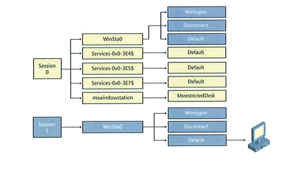
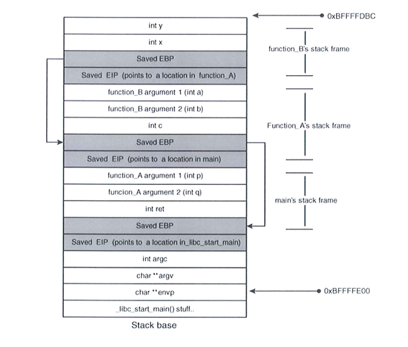

Merged exams from past years
-----------------------------

### Design principles
1. Explain the principle of least privilege. What is the intention of this design principle?
	* **Answer**:
2. Choose two more of Saltzer's and Shroeder's design principles and explain them. Use an example if you'd like
	* **Answer**:
3. Explain the principle of complete mediation. What is the intention of this design principle and what do you need to be aware of when implementing access checks?
	* **Answer**:
4. Explain the principle of fail-safe defaults. What is the intention of this design principle and what do you need to be aware of when implementing access checks?

---------------------------

### Secure Agile Software Development Process (guest lecture)
5. Agile BSSD introduces 3 additional roles to Scrum. What are these roles and what is their purpose?
	* **Answer**:
6. Agile BSSD emphasises threat analysis as an important tool to understand the security risk. How is threat analysis used in BSSD?
	* **Answer**:

---------------------------

### Trusted path & UI security
7. What is a trusted path according to TCSEC?
	* **Answer**:
8. How does the UAC User Account Control feature on Windows make use of a trusted path and why?
	* **Answer**:
9. What is the difference between a window station and a desktop?
	* **Answer**:
10. Microsoft Windows uses sessions and window stations to isolate processes and desktops to protect UI access. Have a look at the diagram. Why is session 0 special?
	* **Answer**:
11. Winlogon is the desktop for the logon process, Disconnect is the desktop for screensaver and Default is the desktop created for the user's shell upon logon. How is malware running in the Default desktop prevented from interacting with the user when the Winlogon desktop is active and receives input?
	* **Answer**:
12. How is the sending of Window messages regulated between threads on the same desktop, between threads attached to different desktops? What is the effect of UIPI User Interface Privilege Isolation?
	* **Answer**:

---------------------------

### Code & design reviews
13. What is the purpose of a review and how does it differ from software testing?
	* **Answer**:
14. What strategies do you know to reduce the amount of information processed during a review?
	* **Answer**:
15. What can static analysis tools detect? What do they overlook?
	* **Answer**:

---------------------------

### Concurrency
16. What is a race condition?
	* **Answer**:
17. Why are file race conditions a bigger problem in Unix software than in Windows software?
	* **Answer**:
18. Which trend in computing architectures makes programs more susceptible to race conditions, i.e increases parallel execution relating to shared resources
	* **Answer**:

---------------------------

### String representation
19. Describe how memory is used in different approaches to string representation pointer+null byte (e.g C) vs pointer+length (e.g Pascal). Use two sketches to show how the string "abcd" is stored in memory
	* **Answer**:
20. What precautions need to be applied to string handling when using C++?
	* **Answer**:
21. Consider a type-safe language like Java or C#. Will that prevent you from (accidentally) writing to memory past the boundary of a string? If so, why? If not, why not? Use an example if you like
	* **Answer**:

---------------------------

### Code signing
22. What is the added value of an Extended Validation code signing certificate?
	* **Answer**:
23. How can signed code help users in investigating security incidents?
	* **Answer**:
24. How can signed code help to protect software vendors from liability claims?
	* **Answer**:

---------------------------

### Code inspection and analysis tools
25.	What is the purpose of an inspection and how does it differ from software testing?
	* **Answer**:
26. What strategies do you know how to approach an inspection? What tools support these strategies?
	* **Answer**:
27. What is a static analysis and how can it be used to improve software security?
	

---------------------------

### Maintenance
28. What is a patch and why are patches used in software maintenance?
	* **Answer**:
29. Can a patch increase vulnerability of an application? Why? Why not?
	* **Answer**:
30. How do the following three approaches to distribution of corrected software versions differ: Locally maintained installation, app store, externally hosted application? Discuss periods of vulnerability, single point of failure, backup and compatibility with dependent applications.
	* **Answer**:

---------------------------

### Buffer Overflows
31. Explain a buffer overflow attack using the figure. Describe the elements of the figure and present a situation where a buffer overflow occurs, how it functions and what its effects can be. If you want to use sample code to explain, please do so. If you can do it without using sample code, that is also fine.
	* **Answer**:
32. Which property of current memory architecture allows a buffer overflow to overwrite code during execution of a program?
	* **Answer**:
33. Choose a method to protect a program against buffer overflows and explain how it works, why it's a good choice and what its limits are
	* **Answer**:

